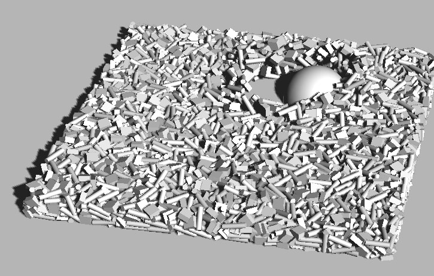

GPGPU rigid body physics for Three.js
=====================================

[Launch demo](https://schteppe.github.io/gpu-physics.js/) or [watch the video](https://www.youtube.com/watch?v=PfCZEQxTvqA). NOTE: Works only on desktops with good GPUs.



## Usage

Include gp.js into your Three.js project HTML:

```html
<script src="gp.js"></script>
```

Sample code below. See the [examples/](examples/) directory for full examples.

```js
// Create a simulation world
var world = new gp.World({
    renderer: threejsRenderer,            // Must be a THREE.WebGLRenderer
    maxBodies: 128 * 128,                 // Max number of bodies
    maxParticles: 128 * 128,              // Max number of particles (each body consists of a number of particles)
    radius: 0.05,                         // Size of a particle in the simulation
    stiffness: 100,                       // Contact stiffness
    damping: 0.4,                         // Contact damping
    fixedTimeStep: 1/60,                  // Simulation timestep
    boxSize: new THREE.Vector3(10,10,10), // World collision bounds

    // The "grid" is a box where collisions can occur. Specify its position and resolution.
    // The size of the grid box is gridResolution * radius
    gridPosition: new THREE.Vector3(0,0,0),
    gridResolution: new THREE.Vector3(128,16,128),

    gravity: new THREE.Vector3(0,-1,0),
    friction: 0.4,
    drag: 0.3,
});

// Create a body
//                         position   rotation   mass  inertia
var bodyId = world.addBody(0, 0, 0,   0,0,0,1,   1,    0.1,0.1,0.1);
world.addParticle(bodyId, 0,0,0); // Add a particle in the center of the body

// Get the UV coordinate for the body
var uv = world.getBodyUV(bodyId);
myCustomShaderMaterial.uniforms.bodyUV = uv;

// A simple render loop can look like this:
var prevTime;
function render() {
    // Update physics
    var deltaTime = prevTime === undefined ? 0 : (time - prevTime) / 1000;
    world.step( deltaTime );
    prevTime = time;

    // You can during runtime use textures from the world, they contain positions and rotations of all bodies
    // Note that you need to fetch these textures every frame, since they are swapped by the World every step.
    myCustomShaderMaterial.uniforms.bodyPositionTex.value = world.bodyPositionTexture;
    myCustomShaderMaterial.uniforms.bodyQuaternionTex.value = world.bodyQuaternionTexture;

    // Render scene
    renderer.render( scene, camera );
}
```

## Implementation

The demo is largely based on [GPU Gems 3 ch. 29, Real-Time Rigid Body Simulation on GPUs](https://developer.nvidia.com/gpugems/GPUGems3/gpugems3_ch29.html). It heavily relies on the `THREE.WebGLRenderTarget` class and custom shaders.

The simulation loop is in short:

<ol>
<li>Create float render targets of size N*N for bodies: position, quaternion, velocity, angular velocity, force, torque.</li>
<li>Create float render targets of size M*M for particles: local position, world position, relative position, force.</li>
<li>Create float render target of size 4*M*M for a broadphase grid.</li>
<li>While running:</li>
<ol>
<li>Calculate particle properties: world position, body-relative position, velocity.</li>
<li>Set up "broadphase render target". Stencil buffer is set up for stencil routing (see <a href="http://www.gpgpu.org/static/s2007/slides/15-GPGPU-physics.pdf">this presentation, slide 24</a>) by clearing once (to set stencil values to zero) and drawing point clouds thrice to set values 1, 2 and 3 into the stencil buffer. An alternative is using PBOs to set these values, but it doesn't seem to be available in WebGL1.</li>
<li>Particles are drawn to the "broadphase render target" using GL_POINTS with point-size 2. This maps them into the correct "grid bucket" and writes the particle ID's there. The stencil routing guarantees four particle ID's can be drawn into the same grid bucket in this single draw call.</li>
<li>Particle forces are calculated using spring-and-dashpot model equations. Neighboring particles are easily looked up in the broadphase render target.</li>
<li>Forces are added to the bodies' force render target using GL_POINTS with additive blending. Other forces such as gravity is added here too.</li>
<li>Torque is added to bodies' torque render target in the same way.</li>
<li>Body velocities are updated: velocity += deltaTime * force / inertia.</li>
<li>Body positions are updated: position += deltaTime * velocity.</li>
<li>Render each body by looking up body position and quaternion in the correct render target texture.</li>
</ol>
</ol>